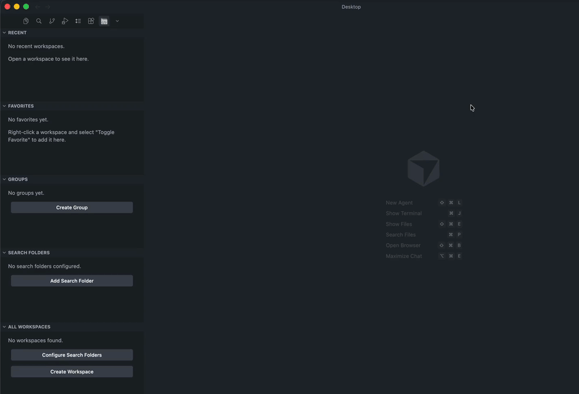

# Workspace Hub

Discover, organize, and switch workspaces effortlessly — with favorites, groups, pinned workspaces, search folders, and quick switch.

## Features

- **All Workspaces** — Automatically discovers `.code-workspace` files and git repositories from configured search folders
- **Favorites** — Star your most-used workspaces for quick access
- **Pinned** — Pin workspaces to keep them always visible at the top
- **Groups** — Organize workspaces into color-coded groups
- **Recent** — Tracks your recently opened workspaces
- **Search Folders** — Visual sidebar listing of configured scan directories with add/remove controls
- **Quick Switch** — Keyboard shortcut to instantly switch between workspaces (`Cmd+Alt+W` / `Ctrl+Alt+W`)
- **Search** — Full-text search across all discovered workspaces
- **Tree & List Views** — Toggle between tree (grouped by folder) and flat list display
- **Sorting** — Sort by name, last modified, last opened, or frequency
- **Include/Exclude Git Folders** — Toggle whether git repositories are treated as workspaces

## Getting Started

1. Install the extension
2. Open the **Workspace Hub** panel in the activity bar
3. Click the **+** button in the Search Folders section to add directories to scan
4. Your workspaces will appear in the **All Workspaces** section

## Keyboard Shortcuts

| Shortcut | Action |
|---|---|
| `Cmd+Alt+W` / `Ctrl+Alt+W` | Quick Switch Workspace |
| `Cmd+Shift+Alt+W` / `Ctrl+Shift+Alt+W` | Search Workspaces |
| `Cmd+Alt+N` / `Ctrl+Alt+N` | Create Workspace |

## Configuration

| Setting | Default | Description |
|---|---|---|
| `workspaceHub.searchFolders` | `[]` | Root folders to scan for workspaces |
| `workspaceHub.searchDepth` | `5` | Maximum scan depth |
| `workspaceHub.includeGitFolders` | `true` | Treat git repositories as workspaces |
| `workspaceHub.excludePatterns` | `[...]` | Glob patterns to exclude from scanning |
| `workspaceHub.viewMode` | `tree` | Display mode (tree or list) |
| `workspaceHub.sortField` | `name` | Sort criterion |
| `workspaceHub.recentCount` | `10` | Max recent workspaces to remember |
| `workspaceHub.cacheExpiration` | `300` | Cache TTL in seconds |

## License

MIT
